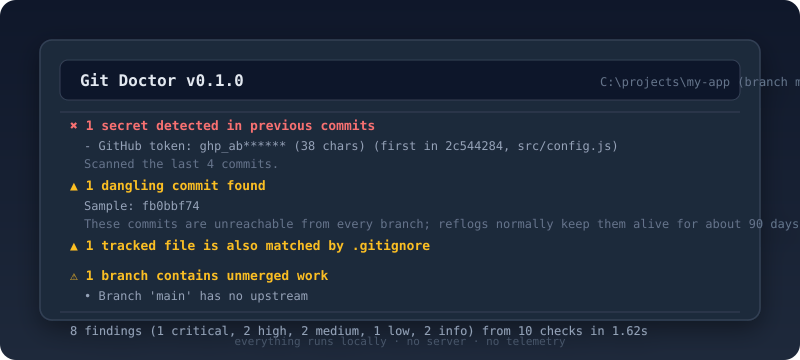

# Git Doctor


**Diagnose broken and confusing Git repositories.** Like ESLint for your Git repo.

`git-doctor` inspects a repository and reports what is wrong — with concrete commands to fix it.

```
Git Doctor v0.1.0
C:\projects\my-app (branch main, c9ec4ab2)

  ✖ 1 secret detected in previous commits
       - GitHub token: ghp_ab****** (38 chars) (first in 2c544284, src/config.js)
       Scanned the last 4 commits.
  ▲ 1 dangling commit found
       Sample: fb0bbf74
       These commits are unreachable from every branch; reflogs normally keep them alive for about 90 days.
  ▲ 1 tracked file is also matched by .gitignore
  ⚠ 1 branch contains unmerged work
  • Branch 'main' has no upstream

Recommended actions

  1. Rotate the exposed credential
       Revoke and regenerate them in the provider dashboard first - treat them as compromised.
  2. Inspect the 1 dangling commit
       git fsck --lost-found
       git show <sha>
  3. Stop tracking the sensitive files
       git rm --cached .env

8 findings (1 critical, 2 high, 2 medium, 1 low, 2 info) from 10 checks in 1.62s
```



Everything runs **locally**. No server, no telemetry, and your repository never leaves your machine.


## Install

```bash
npm install -g git-doctor-cli
```

The package is `git-doctor-cli`; the command it installs is `git-doctor`.

Requires Node.js 20+ and `git` on your PATH.

## Usage

```bash
git-doctor                 # inspect the repository in the current directory
git-doctor path/to/repo    # inspect another repository
git-doctor --json          # machine-readable report (for CI)
git-doctor -v              # also show the checks that passed
git-doctor --list-checks   # what can be checked
```

### Options

| Option | Default | Description |
| --- | --- | --- |
| `--checks <ids>` | all | run only the listed checks |
| `--skip <ids>` | none | skip the listed checks |
| `--history <n>` | `200` | commits to scan for secrets (`0` = full history) |
| `--max-file-size <mb>` | `50` | flag files larger than this anywhere in history |
| `--stale-days <n>` | `90` | age before a merged branch counts as stale |
| `--fail-on <level>` | `high` | severity that makes the command exit `1` |
| `--ignore-file <path>` | `<repo>/.gitdoctorignore` | file with ignore rules |
| `--no-ignore` | | do not read `.gitdoctorignore` |
| `--json` | | print a JSON report |
| `-v, --verbose` | | include passing checks |
| `-q, --quiet` | | no output, exit code only |
| `--no-color` | | disable colors |

### Exit codes

| Code | Meaning |
| --- | --- |
| `0` | no findings at or above `--fail-on` |
| `1` | findings at or above `--fail-on` |
| `2` | fatal error, or at least one check failed |

This makes it usable as a CI gate:

```yaml
- run: npx git-doctor-cli --fail-on high
```

## Ignoring findings you accept

Some findings are deliberate — test fixtures with fake tokens, an internal repo
with no remote, a project that is fine being dirty. Record them in
`.gitdoctorignore` at the repository root and they stop affecting the exit code
(they are still counted and reported as hidden):

```
# comments and blank lines are fine
test/**              # any check: matching paths
secrets              # every finding of one check
secrets:test/**      # one check: matching paths
```

Patterns are globs: `*` stays inside one path segment, `**` crosses
directories, `?` matches one character. Paths are matched against every path,
branch and value a finding carries (`.env`, `assets/big.psd`, `main`, …).

Use `--no-ignore` to see everything, or `--ignore-file <path>` to point at
another file. The library equivalent is `diagnose(path, { ignore: [...] })`.

## Checks

| Check | What it finds |
| --- | --- |
| `repo` | detached HEAD, unfinished merge/rebase/cherry-pick/bisect, unresolved conflicts, uncommitted changes |
| `dangling` | commits unreachable from every branch (lost after a reset, rebase or deleted branch) |
| `branches` | branches with unmerged work, stale merged branches, branches tracking deleted remotes, missing upstream |
| `sync` | branches ahead of / behind their upstream, unpushed commits |
| `large-files` | oversized blobs anywhere in history |
| `secrets` | GitHub/AWS/Slack/OpenAI/Google/Stripe/npm tokens, private keys, generic embedded credentials |
| `ignored-tracked` | files that are committed *and* matched by `.gitignore` (`.env`, keys, …) |
| `config` | missing `user.name`/`user.email`, credentials embedded in remote URLs, missing remotes |
| `submodules` | uninitialized, out-of-date or conflicted submodules, gitlinks without `.gitmodules` |
| `stash` | stashes you may have forgotten |

Every finding comes with concrete commands to run. Secret values are redacted in
all output — text and JSON — so reports are safe to share.

`git-doctor` is **read-only**: it never modifies your repository.

## Use it as a library

```ts
import { diagnose, renderText } from 'git-doctor-cli';

const report = await diagnose('/path/to/repo', { maxFileSizeMB: 100 });
console.log(renderText(report, { color: true, verbose: false }));
```

## Development

```bash
npm install
npm run lint
npm run typecheck
npm test
npm run build
```

Tests build real repositories in a temp directory (detached HEADs, unfinished
merges, dangling commits, secrets, oversized files) and assert what the tool
reports.

## Roadmap

- `git-doctor fix --safe` — apply only reversible fixes, behind a backup ref
- pre-commit / CI reporters and a `--fail-on` profile per team
- Homebrew, Scoop and Winget packages
- VS Code extension and a documentation site

## License

MIT